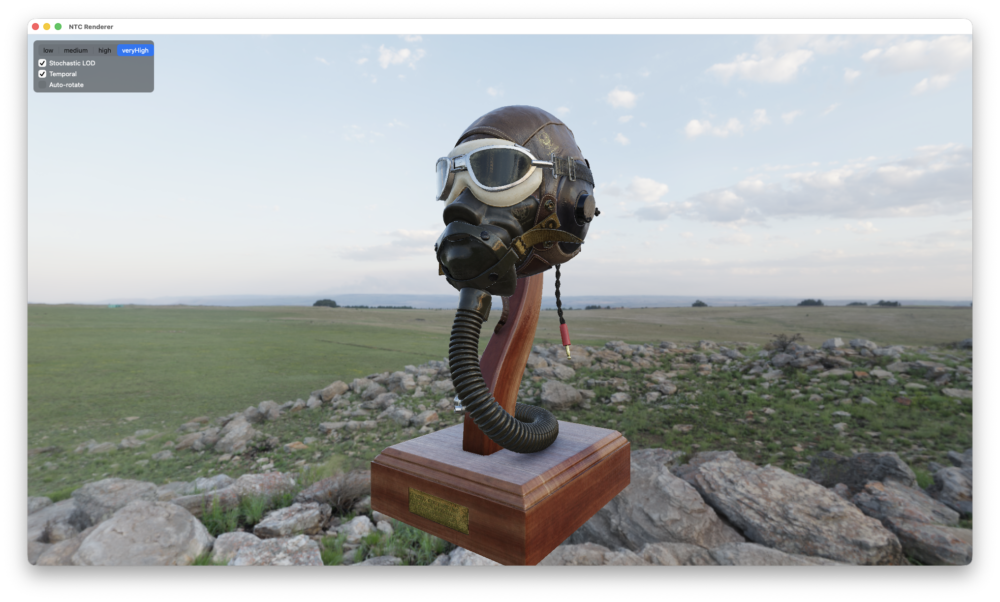

# MetalNTC Renderer

The optional real-time viewer + demo assets for [MetalNTC](https://github.com/Qirias/MetalNTC).



This repository is consumed as a git submodule at `sources/NTCRenderer` of the
main MetalNTC package. On its own it does not build, it depends on the
`NTCCore`, `NTCShared`, and `AAPLMath` targets from the parent package.

Contents:

`*.swift` and `shaders/` contain the `NTCRenderer` app. It renders a glTF mesh and decodes NTC data in the fragment shader for each pixel, with PBR/IBL lighting and temporal STF resolve. The app also includes a benchmark mode that renders a full-screen texture where each pixel runs the forward pass. There are two benchmark variants: one using regular ALUs for devices that do not support tensor cores, and a `benchmarkTensorOps` variant for M5 and newer devices.

## Use

From a fresh clone of the parent repo:

```sh
git clone --recurse-submodules https://github.com/Qirias/MetalNTC.git
```

or, in an existing clone:

```sh
git submodule update --init sources/NTCRenderer
```

Then build the `NTCRenderer` product (Xcode, so the Metal shaders compile into
`default.metallib`). Without the submodule, the parent package simply omits the
`NTCRenderer` target and builds the trainer alone.

## Reference

An independent implementation of the method described in Vaidyanathan et al.,
**Random-Access Neural Compression of Material Textures**, ACM Transactions on
Graphics 42(4), SIGGRAPH 2023. Not affiliated with or endorsed by NVIDIA
Corporation.

## License

**[PolyForm Noncommercial License 1.0.0](LICENSE.md)** — noncommercial use only.
Released for research and education: study, research, teaching, and personal or
hobby projects are permitted; use in or for a commercial product or service is
not. Open an issue if you need commercial terms.

`AAPLMath/` is Apple sample code under its own terms, and the demo assets under
`assets/` carry their own `license.txt`.